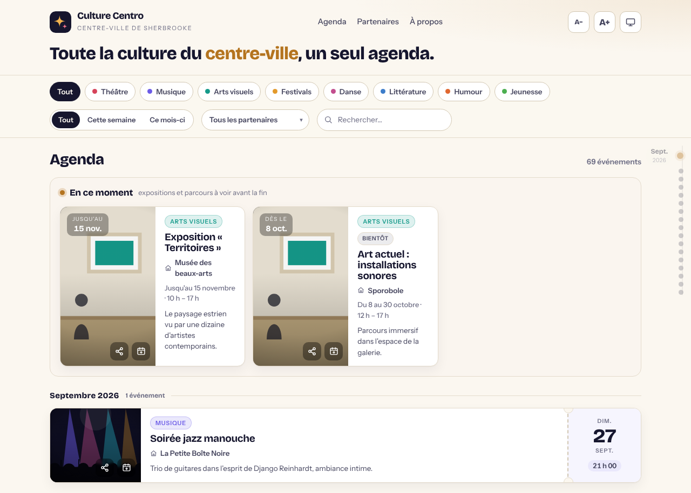

# Culture Centro — agenda culturel du centre-ville de Sherbrooke

[](https://github.com/remtav/culturecentro/actions/workflows/tests.yml)

[](https://github.com/remtav/culturecentro/actions/workflows/publish.yml)

[](LICENSE)

**Culture Centro** réunit en un seul agenda la programmation des salles et
organismes culturels du **centre-ville de Sherbrooke**.

- **Site public** : <https://remtav.github.io/culturecentro/>, régénéré chaque
  jour (voir [Publication](#publication-github-pages)).
- **Salles couvertes** : 7 à ce jour (voir [Sources disponibles](#sources-disponibles)).
- **Sorties** : texte, CSV, JSON, et le feed JSON du site.

[](https://remtav.github.io/culturecentro/)

<sub>Page publique (`web/index.html`) affichée avec son jeu de données de démonstration.</sub>

Récupère la liste des **événements à venir** de la programmation de salles de
spectacle et permet de les exporter en texte, CSV ou JSON. Chaque salle est
une **source** (`culturecentro.sources`) qui n'implémente que l'extraction
propre à son site ; tout le reste — client HTTP, analyse des dates françaises,
repli JSON-LD, modèle d'événement, déduplication, exports et CLI — est fourni
par un **cœur partagé** (`culturecentro.models`, `.http`, `.dates`, `.jsonld`,
`.filtrage`, `.exporters`). Ajouter une salle se limite ainsi à écrire sa
logique d'extraction et à l'inscrire au registre.

## Sommaire

- [Culture Centro — agenda culturel du centre-ville de Sherbrooke](#culture-centro--agenda-culturel-du-centre-ville-de-sherbrooke)
  - [Démarrage rapide](#démarrage-rapide)
  - [Installation](#installation)
  - [Structure du projet](#structure-du-projet)
  - [Sources disponibles](#sources-disponibles)
  - [Schéma d'événement](#schéma-dévénement)
  - [Agrégation — CLI unifiée](#agrégation--cli-unifiée)
    - [Options de la CLI unifiée](#options-de-la-cli-unifiée)
    - [Spectacle annoncé par deux partenaires](#spectacle-annoncé-par-deux-partenaires)
    - [Catégorie artistique automatique](#catégorie-artistique-automatique)
  - [Utilisation en ligne de commande](#utilisation-en-ligne-de-commande)
  - [Utilisation en bibliothèque](#utilisation-en-bibliothèque)
  - [Fonctionnement par salle](#fonctionnement-par-salle)
  - [Site web (web/) et feed](#site-web-web-et-feed)
    - [Feed et filtres](#feed-et-filtres)
    - [Ajouter au calendrier](#ajouter-au-calendrier)
    - [Partage et aperçu riche](#partage-et-aperçu-riche)
    - [Variantes de design](#variantes-de-design)
    - [Générer le feed et les pages de partage](#générer-le-feed-et-les-pages-de-partage)
    - [Publication (GitHub Pages)](#publication-github-pages)
  - [Développement](#développement)
    - [Écrire un test de source](#écrire-un-test-de-source)
  - [Intégration continue](#intégration-continue)
  - [Dépannage](#dépannage)
  - [Contribuer](#contribuer)
  - [Documentation](#documentation)
  - [Licence](#licence)

## Démarrage rapide

Vous débarquez sur le projet ? Voici de quoi être opérationnel en quelques
minutes. Prérequis : **Python ≥ 3.10** et `git`.

```bash
# 1. Cloner et entrer dans le dépôt
git clone https://github.com/remtav/culturecentro.git
cd culturecentro

# 2. Créer un environnement virtuel (recommandé) et l'activer
python -m venv .venv
source .venv/bin/activate          # Windows : .venv\Scripts\activate

# 3. Installer le paquet avec les outils de développement
pip install -e ".[dev]"

# 4. Vérifier que tout fonctionne (tests hors-ligne, aucun accès réseau requis)
python -m pytest

# 5. Agréger la programmation réelle (nécessite un accès réseau)
culturecentro lister
```

> **Astuce** : `culturecentro lister --sans-fiches` est nettement plus rapide
> (il ne lit pas la fiche de chaque événement pour le classer) ; ajouter `-v`
> pour suivre le détail des requêtes et des replis.

Points de repère pour la suite :

- **Explorer** les salles disponibles : `culturecentro sources`.
- **Générer** le feed du site web : `python -m culturecentro lister --format json -o web/data/evenements.json`.
- **Ouvrir** la page publique en local : ouvrir [`web/index.html`](web/index.html)
  dans un navigateur (elle utilise un jeu de démonstration si le feed est absent).
- **Voir la page avec le vrai feed** : servir `web/` en HTTP,
  `python -m http.server --directory web 8000`, puis ouvrir
  <http://localhost:8000>. Ouverte directement depuis le disque (`file://`), la
  page ne peut pas lire `data/evenements.json` (blocage du navigateur) et
  affiche la démo.
- **Ajouter une salle** : lire [`docs/ajouter-une-source.md`](docs/ajouter-une-source.md).
- **Comprendre l'architecture** : lire [`docs/architecture.md`](docs/architecture.md).

Les tests, le lint et le typage tournent **hors-ligne** : aucune requête vers
les sites des salles n'est faite en test (les réponses HTTP sont figées dans des
fixtures). On peut donc développer sans accès réseau ; seule l'exécution réelle
de la CLI (`culturecentro lister`) contacte les sites.

## Installation

```bash
pip install -e .          # ou : pip install -e ".[dev]" pour les outils de dév
```

Le paquet `culturecentro` est installé (layout `src/`). Dépendances :
`requests` et `beautifulsoup4`. Python **3.10 ou plus récent** est requis.

L'installation fournit la commande `culturecentro` ; `python -m culturecentro`
fait la même chose sans dépendre du `PATH`. Pour n'utiliser que la CLI, sans
cloner le dépôt :

```bash
pip install "git+https://github.com/remtav/culturecentro.git"
```

## Structure du projet

```
culturecentro/
├── src/culturecentro/          # le paquet Python (layout « src/ »)
│   ├── __init__.py             # version du paquet (__version__)
│   ├── __main__.py             # point d'entrée « python -m culturecentro »
│   ├── models.py               # Evenement : le schéma unique d'un événement
│   ├── http.py                 # session requests + telecharger() (en-têtes, reprises)
│   ├── dates.py                # analyse des dates en français (« Mardi 29 septembre 2026 »)
│   ├── jsonld.py               # repli sur les données schema.org (JSON-LD)
│   ├── scraping.py             # utilitaires HTML partagés (url_image, premiere_image…)
│   ├── categories.py           # classement artistique automatique
│   ├── lieux.py                # noms canoniques + périmètre du centre-ville
│   ├── filtrage.py             # déduplication, filtre temporel et tri
│   ├── exporters.py            # sorties texte / CSV / JSON
│   ├── aggregate.py            # agrège toutes les salles, tolérant aux pannes
│   ├── partage.py              # pages de partage (aperçu riche Open Graph)
│   ├── cli.py                  # interfaces en ligne de commande
│   └── sources/                # une source par salle, derrière une interface commune
│       ├── base.py             # classe abstraite Source (orchestration partagée)
│       ├── __init__.py         # registre SOURCES {slug: Source}
│       ├── theatre_granada.py
│       ├── lapetiteboitenoire.py
│       ├── maisondesartsdelaparole.py
│       ├── tremplin16_30.py
│       ├── mbas.py
│       ├── sporobole.py
│       └── legrandespace.py
├── tests/                      # tests pytest (hors-ligne)
│   ├── unit/                   # cœur partagé (dates, filtrage, exports…)
│   └── sources/                # une salle par fichier, sur des fixtures HTML
├── web/                        # page publique autonome + feed généré
│   ├── index.html
│   ├── logo.svg                # logo provisoire (en-tête, pied de page, icône d'onglet)
│   ├── apple-touch-icon.png    # logo pour l'écran d'accueil iOS
│   ├── img/partage.png         # image d'aperçu par défaut (1200×630)
│   ├── data/evenements.json
│   ├── variantes/              # cinq maquettes de design + page de comparaison
│   ├── 404.html                # page « événement introuvable » (générée au déploiement)
│   └── e/<id>/index.html       # pages de partage (générées au déploiement)
├── docs/                       # architecture, guide d'ajout de source, partenaires
│   ├── architecture.md
│   ├── ajouter-une-source.md
│   ├── partenaires.md
│   ├── inspiration.md
│   ├── img/apercu.png          # capture de la page publique (en-tête du README)
│   └── sources/                # une fiche technique par salle (+ modèle de fiche)
├── scripts/                    # utilitaires (ex. génération du badge de couverture)
│   └── coverage_badge.py
├── .github/workflows/          # intégration continue et publication GitHub Pages
│   ├── tests.yml               # qualité, tests, couverture
│   └── publish.yml             # feed + pages de partage → GitHub Pages
├── .pre-commit-config.yaml     # hooks ruff + mypy (facultatifs)
├── coverage.svg                # badge de couverture (régénéré par la CI)
├── LICENSE
└── pyproject.toml              # métadonnées du paquet et config des outils
```

Le flux général : chaque `Source.extraire()` transforme le HTML d'une salle en
`list[Evenement]`, `finaliser()` déduplique / filtre / trie, `agreger()`
rassemble toutes les salles, et les `exporters` produisent la sortie (texte,
CSV, JSON, ou le feed JSON du site). Voir [`docs/architecture.md`](docs/architecture.md)
pour le schéma détaillé.

## Sources disponibles

| Salle | Slug (`--source`) | Module | Source | Catégorie par défaut |
| --- | --- | --- | --- | --- |
| [Théâtre Granada](https://theatregranada.com/programmation-2/) | `theatre-granada` | `culturecentro.sources.theatre_granada` | WPBakery (grille AJAX) | `musique` |
| [La Petite Boîte Noire](https://lapetiteboitenoire.com/evenements/) | `la-petite-boite-noire` | `culturecentro.sources.lapetiteboitenoire` | billetterie Lepointdevente | `musique` |
| [Maison des arts de la parole](https://maisondesartsdelaparole.com/programmation/) | `maison-des-arts-de-la-parole` | `culturecentro.sources.maisondesartsdelaparole` | calendrier EventON (AJAX mois par mois) | `litt` |
| [Le Tremplin 16-30](https://tremplin16-30.com/evenements/) | `tremplin-16-30` | `culturecentro.sources.tremplin16_30` | blocs Gutenberg « média + texte » | `musique` |
| [Musée des beaux-arts de Sherbrooke](https://mbas.qc.ca/en-cours/) | `mbas` | `culturecentro.sources.mbas` | pages « en cours » + « à venir » (blocs `#rectangle`) | `arts` |
| [Sporobole](https://sporobole.org/programmation/) | `sporobole` | `culturecentro.sources.sporobole` | liste AJAX du thème (diffusions, paginée) | `arts` |
| [Le Grand-Espace](https://legrandespace.ca/public/grand-public/) | `le-grand-espace` | `culturecentro.sources.legrandespace` | pages grand public + jeune public de l'édition en cours | `theatre` |

Le registre faisant autorité est [`culturecentro.sources.SOURCES`](src/culturecentro/sources/__init__.py) ;
`culturecentro sources` l'affiche (slug + nom). La catégorie par défaut
(`Source.categorie_defaut`) ne sert qu'en dernier recours, quand rien d'autre
ne permet de classer un événement (voir
[Catégorie artistique automatique](#catégorie-artistique-automatique)). Le
détail de chaque extraction est dans sa fiche,
[`docs/sources/<slug>.md`](docs/sources/) (voir
[Fonctionnement par salle](#fonctionnement-par-salle)).

Les autres partenaires du centre-ville, et l'état de leur intégration, sont
suivis dans [`docs/partenaires.md`](docs/partenaires.md) : c'est la feuille de
route des prochaines sources.

## Schéma d'événement

Toutes les sources produisent le **même schéma** d'événement (colonnes
`titre`, `sous_titre`, `date_debut`, `date_fin`, `lien`, `image`, `lieu`,
`partenaire`, `categorie`) : un champ non exposé par une salle vaut simplement `None`
(p. ex. `sous_titre` pour La Petite Boîte Noire). `partenaire` est l'organisme
qui programme l'événement (le nom de la source) ; `lieu` est l'endroit où il
se tient, qui peut différer (programmation hors les murs). `date_fin` n'est renseignée que pour ce qui
s'étale dans le temps (exposition, série d'ateliers, spectacle à l'affiche
plusieurs jours) ; un tel événement **déjà commencé** reste listé tant que sa
fin n'est pas passée.

Chaque source récupère l'**affiche** (`image`) dès que le site en expose une :
l'utilitaire partagé `culturecentro.scraping.url_image` lit indifféremment
`src`, les attributs de chargement différé (`data-src`, `srcset`…) et les fonds
CSS (`background-image`), et `premiere_image` sert de repli sur tout le bloc de
l'événement. La page web affiche cette affiche en vignette lorsqu'elle existe.

Le détail des champs et de leur sérialisation est donné dans
[Utilisation en bibliothèque](#utilisation-en-bibliothèque).

Exemple d'événement dans le feed `web/data/evenements.json` (valeurs
illustratives). Les dates sont en ISO 8601, sans fuseau : ce sont des heures
locales (`America/Toronto`), et le filtre « à venir » part de minuit, heure de
Sherbrooke (`culturecentro.filtrage.minuit_local`). La
clé `id` n'est pas un champ d'`Evenement` : elle est ajoutée au feed par
`culturecentro pages`, pour les seuls événements datés (voir
[Générer le feed et les pages de partage](#générer-le-feed-et-les-pages-de-partage)).

```json
{
  "titre": "Les Belles-Sœurs",
  "sous_titre": null,
  "date_debut": "2026-10-03T20:00:00",
  "date_fin": null,
  "lien": "https://theatregranada.com/…",
  "image": "https://theatregranada.com/…/affiche.jpg",
  "lieu": "Théâtre Granada",
  "partenaire": "Théâtre Granada",
  "categorie": "theatre",
  "id": "les-belles-soeurs-2026-10-03"
}
```

## Agrégation — CLI unifiée

La commande `culturecentro` (ou `python -m culturecentro`) agrège toutes les
salles enregistrées en une seule liste, dédupliquée et triée par date. Le
`partenaire` et, s'il manque, le `lieu` sont renseignés avec le nom de la
salle ; les lieux sont ramenés à leur **nom canonique** (« Le Grand Espace »
→ « Le Grand-Espace », « Salle multifonctionnelle du Tremplin » → « Le
Tremplin 16-30 »…) et les événements **hors du centre-ville** (autre
municipalité, campus, quartier périphérique) sont écartés — voir
`culturecentro.lieux`, dont les listes de lieux connus, de rues du
centre-ville et de marqueurs hors périmètre sont la « carte » éditable du
projet. Une salle indisponible est ignorée avec un avertissement (les autres
sont conservées).

```bash
culturecentro sources                     # liste les salles enregistrées
culturecentro lister                      # agrège toutes les salles (texte)
culturecentro lister --format json        # agrège en JSON
culturecentro lister --source theatre-granada --format csv -o prog.csv
culturecentro lister --source mbas --source sporobole   # plusieurs salles (option répétable)
culturecentro lister --sans-fiches        # sans lecture des fiches d'événement (catégories)
python -m culturecentro lister            # équivalent sans le script installé
```

### Options de la CLI unifiée

`culturecentro` a trois sous-commandes : `sources` (liste des salles, sans
option), `lister` et `pages`.

| Sous-commande | Option | Description |
| --- | --- | --- |
| `lister` | `--source SLUG` | Limite à cette salle ; répétable. Défaut : toutes. Slugs : `culturecentro sources`. |
| `lister` | `--format {texte,csv,json}` | Format de sortie (défaut : `texte`). |
| `lister` | `-o`, `--sortie FICHIER` | Écrit dans un fichier (sinon : sortie standard). |
| `lister` | `--timeout SECONDES` | Délai réseau, par requête (défaut : 20). |
| `lister` | `--sans-fiches` | Ne lit pas la fiche des événements pour les classer (plus rapide, classement moins fin). |
| `lister` | `-v`, `--verbose` | Journalisation niveau DEBUG. |
| `pages` | `--url-base URL` | **Obligatoire.** Adresse publique du site (URL absolue, pour Open Graph). |
| `pages` | `--feed FICHIER` | Feed produit par `lister` (défaut : `web/data/evenements.json`). |
| `pages` | `--dossier DOSSIER` | Racine du site (défaut : `web`). |
| `pages` | `-v`, `--verbose` | Journalisation niveau DEBUG. |

Codes de sortie : `0` en cas de succès ; `1` pour un échec réseau qui empêche
l'agrégation, ou un feed illisible ou qui n'est pas une liste d'événements
(`pages`) ; `2` pour un slug inconnu (`lister --source`) ou une `--url-base`
qui ne commence pas par `http://` ou `https://` (`pages`). La CLI propre à
chaque salle (voir [Utilisation en ligne de commande](#utilisation-en-ligne-de-commande))
accepte en plus `--url`, pour analyser une autre page que la page officielle.

### Spectacle annoncé par deux partenaires

Un même spectacle figure parfois sur la page de deux partenaires : celui qui
le présente et celui qui l'accueille (le Théâtre Granada annonce les
spectacles qu'il présente à La Petite Boîte Noire ; la Maison des arts de la
parole, la clôture de son festival au Grand-Espace). L'agrégation n'en garde
qu'**un** (`culturecentro.filtrage.fusionner_doublons`). Deux annonces sont
considérées comme le même événement si :

- elles viennent de **deux partenaires différents** (un même partenaire qui
  annonce deux fois un titre le même jour donne deux représentations) ;
- elles tombent le **même jour à la même heure** (ou l'heure manque d'un côté) ;
- elles sont de même nature : deux représentations ponctuelles, ou deux
  événements sur plusieurs jours (une soirée n'est pas fondue dans la série du
  même nom) ;
- les mots significatifs d'un titre figurent tous dans l'autre (« Maxime
  Gervais » / « Maxime Gervais : C'était Magnifique »).

L'annonce **la plus complète** est conservée (le plus de champs renseignés :
sous-titre, heure, fin, affiche, lien ; puis le texte le plus long ; à
égalité, la première salle du registre) : son partenaire, son lieu et son lien
font foi. Elle est complétée par ce que seule l'autre apporte : le titre le
plus complet, l'heure de début, et le sous-titre, la fin ou l'affiche qui lui
manquent. Chaque fusion est journalisée (`INFO`). Sur la page web, le filtre
par partenaire retient aussi le lieu : l'événement fusionné reste visible sous
les deux partenaires.

### Catégorie artistique automatique

La catégorie (`categorie`) n'est **pas** fixée par partenaire : elle est
déterminée pour chaque événement, dans cet ordre (`culturecentro.categories`) :

1. ce que le site du partenaire expose lui-même — taxonomie WordPress du
   Théâtre Granada (« Musique », « Humour », « Hommage »…, lue via l'API REST
   `wp/v2/categories`), catégorie déclarée sur la billetterie Lepointdevente
   pour La Petite Boîte Noire (« Humour », « Arts littéraires »…), page
   « jeune public » du Grand-Espace (`jeunesse`, sauf les spectacles dont
   l'âge minimal dépasse 12 ans, comme « 15 ans et plus »), nature du
   partenaire pour un musée ou un centre d'art (`arts`) ;
2. les **mots-clés** du titre et du sous-titre (genre, distribution : « Théâtre
   classique revisité », « Spectacle de conte », « En rodage », « Hommage à
   Pink Floyd »…) ; un public jeunesse explicite (« dès 4 ans », « jeune
   public », « en famille ») l'emporte sur le genre. Un âge minimal de 13 ans
   ou plus (« 15 ans et plus », « 18 ans et + ») est au contraire une
   restriction : il ne désigne pas un public jeunesse ;
3. la **fiche de l'événement** (page `lien`) : catégories et étiquettes du
   site, type schema.org (`MusicEvent`, `TheaterEvent`, `DanceEvent`…),
   description ; une requête par fiche, avec cache et garde-fou (désactivable
   avec `--sans-fiches`) ;
4. à défaut, la catégorie par défaut du partenaire (`Source.categorie_defaut`).

Le classement est déterministe et n'utilise ni service tiers ni modèle de
langage : il s'exécute tel quel en intégration continue (GitHub Actions).

Les clés de catégorie et leur libellé affiché
([`culturecentro.categories.CATEGORIES`](src/culturecentro/categories.py)) :

| Clé (`categorie`) | Libellé |
| --- | --- |
| `theatre` | Théâtre |
| `musique` | Musique |
| `humour` | Humour |
| `danse` | Danse |
| `arts` | Arts visuels |
| `litt` | Littérature et conte |
| `jeunesse` | Jeunesse |
| `festival` | Festivals |

## Utilisation en ligne de commande

Cette section porte sur la CLI **propre à chaque salle**, utile pour mettre au
point ou diagnostiquer une source isolément. Elle déduplique, filtre (à venir)
et trie, mais ne ramène pas les lieux à leur nom canonique, n'écarte pas les
événements hors du centre-ville et ne complète pas la catégorie : seule celle
que le site expose lui-même est renseignée. Pour la liste agrégée, voir
[Agrégation — CLI unifiée](#agrégation--cli-unifiée).

Chaque source s'exécute comme un module du paquet :

```bash
python -m culturecentro.sources.theatre_granada                     # liste texte
python -m culturecentro.sources.theatre_granada --format json       # JSON
python -m culturecentro.sources.theatre_granada --format csv -o evenements.csv
python -m culturecentro.sources.theatre_granada -v                  # journalisation DEBUG
```

Options principales :

| Option | Description |
| --- | --- |
| `--url` | Page de programmation à analyser (défaut : la page officielle). |
| `--format {texte,csv,json}` | Format de sortie (défaut : `texte`). |
| `-o`, `--sortie FICHIER` | Écrit dans un fichier (sinon : sortie standard). |
| `--timeout SECONDES` | Délai réseau (défaut : 20). |
| `-v`, `--verbose` | Journalisation niveau DEBUG. |

## Utilisation en bibliothèque

```python
from culturecentro.sources.theatre_granada import (
    lister_evenements_a_venir,
    exporter_json,
    exporter_csv,
)

evenements = lister_evenements_a_venir()
for ev in evenements:
    print(ev)  # 2026-09-27 20:00 — Jesse Cook (https://…)

exporter_json(evenements, "evenements.json")
exporter_csv(evenements, "evenements.csv")
```

Chaque `Evenement` expose :

| Champ | Description |
| --- | --- |
| `titre` | Nom de l'événement. |
| `sous_titre` | Mention / sous-titre (ex. « SUPPLÉMENTAIRE », nom de tournée), ou `None`. |
| `date_debut` | `datetime` (naïf, supposé heure locale) ou `None`. |
| `date_fin` | `datetime` de fin (exposition, série…) ou `None`. |
| `lien` | URL de la fiche de l'événement. |
| `image` | URL de l'affiche. |
| `lieu` | Nom du lieu (`None` si c'est la salle du partenaire ; l'agrégation le complète). |
| `partenaire` | Organisme qui programme l'événement (nom de la source ; renseigné par `Source`). |
| `categorie` | Catégorie artistique (`theatre`, `musique`, `humour`, `danse`, `arts`, `litt`, `jeunesse`, `festival`), déterminée automatiquement à l'agrégation (voir [Catégorie artistique automatique](#catégorie-artistique-automatique)). |

`to_dict()` renvoie ces champs sérialisables (date au format ISO 8601), et
les exports CSV/JSON reprennent les mêmes colonnes.

Pour la liste **agrégée** (toutes les salles, lieux normalisés, filtre
centre-ville, catégorisation, fusion des doublons), utiliser `agreger()` ; le
registre donne accès à chaque source par son slug :

```python
from datetime import datetime

from culturecentro.aggregate import agreger
from culturecentro.exporters import exporter_csv, exporter_json, exporter_texte
from culturecentro.sources import obtenir

evenements = agreger()  # toutes les salles enregistrées
exporter_json(evenements, "web/data/evenements.json")

# Quelques salles, sans lecture des fiches, à partir d'une date donnée
musees = agreger(
    [obtenir("mbas"), obtenir("sporobole")],
    a_partir_de=datetime(2026, 11, 1),
    lire_fiches=False,
)
print(exporter_texte(musees))

# Une seule salle, sans l'agrégation
granada = obtenir("theatre-granada").lister_evenements_a_venir(timeout=30)
```

Les trois exporteurs (`exporter_texte`, `exporter_csv`, `exporter_json`)
renvoient toujours la chaîne produite, et l'écrivent en plus dans le fichier
s'il est fourni. Les fonctions `lister_evenements_a_venir`, `exporter_json` et
`exporter_csv` sont aussi importables depuis chaque module de source.

## Fonctionnement par salle

Chaque salle a sa **fiche technique** dans [`docs/sources/`](docs/sources/) :
page analysée, technique d'extraction (AJAX, billetterie, calendrier…), replis
et particularités, commandes d'exemple. Toutes suivent l'interface et les
options communes décrites plus haut ; par exemple :

```bash
python -m culturecentro.sources.theatre_granada --format json
```

| Salle | En bref | Fiche |
| --- | --- | --- |
| Théâtre Granada | WordPress / WPBakery : un appel AJAX (`vc_get_vc_grid_data`) renvoie toute la grille ; les catégories WordPress donnent le genre ou le lieu. Replis : grille inline, JSON-LD, The Events Calendar. | [`theatre-granada.md`](docs/sources/theatre-granada.md) |
| La Petite Boîte Noire | Widget de la billetterie Lepointdevente : liste des spectacles, lien vers leur fiche de billetterie ; catégorie lue via la recherche du site (4 requêtes). Replis : URL de billetterie connue, JSON-LD. | [`la-petite-boite-noire.md`](docs/sources/la-petite-boite-noire.md) |
| Maison des arts de la parole | Calendrier EventON : mois courant, puis 12 mois rejoués en AJAX (`the_ajax_hook`, nonce de la page) ; spectacles souvent hors les murs. Repli : JSON-LD. | [`maison-des-arts-de-la-parole.md`](docs/sources/maison-des-arts-de-la-parole.md) |
| Le Tremplin 16-30 | Blocs Gutenberg « média + texte » ; dates en texte libre, souvent sans année : une liste de dates donne un événement par date, « tous les mercredis… » une série. Repli : JSON-LD. | [`tremplin-16-30.md`](docs/sources/tremplin-16-30.md) |
| Musée des beaux-arts de Sherbrooke (MBAS) | Expositions des pages « en cours » et « à venir » (blocs `div#rectangle`) ; la période donne début et fin, une exposition permanente n'a pas de date. Repli : JSON-LD. | [`mbas.md`](docs/sources/mbas.md) |
| Sporobole | Liste AJAX du thème (`standish_select_refresh`) : seules les diffusions, page après page, tant qu'elles sont en cours ou à venir. Repli : JSON-LD. | [`sporobole.md`](docs/sources/sporobole.md) |
| Le Grand-Espace | Pages grand public et jeune public de l'édition (saison) en cours (`?edition=2026-2027`) ; spectacles « [Terminé] » ignorés. Repli : JSON-LD. | [`le-grand-espace.md`](docs/sources/le-grand-espace.md) |

## Site web (`web/`) et feed

Le dossier [`web/`](web/) contient la **page publique** (`index.html`,
autonome, sans dépendance) : agenda filtrable par discipline, période et lieu,
fil chronologique par mois, bande « En ce moment », et une flèche « Revenir en
haut » qui apparaît en bas à droite dès que l'on descend dans la liste.

**Logo.** Le logo actuel (deux étincelles sur tuile sombre) est **provisoire**,
en attendant le logo officiel. Il tient dans un seul fichier,
[`web/logo.svg`](web/logo.svg), qu'utilisent l'en-tête, le pied de page et
l'icône d'onglet : pour changer de logo, remplacer ce fichier, puis refaire
`web/apple-touch-icon.png` (écran d'accueil iOS, 180 × 180) et l'image
d'aperçu `web/img/partage.png`, qui le reprennent.

**Affichage « billet ».** Sur tablette et ordinateur, chaque carte de la liste
datée porte à droite un talon détachable (jour, date, mois, heure) ; sur
téléphone, ou quand le texte est très agrandi, le talon s'efface et la date
reste en pastille sur l'image. Le seuil suit la largeur de la liste (requête de
conteneur), pas celle de l'écran.

### Feed et filtres

La page charge le **feed agrégé** [`web/data/evenements.json`](web/data/) s'il
est présent et non vide ; sinon elle retombe sur un jeu de données de
démonstration (utile pour l'ouvrir localement). Le filtre déroulant porte sur
le **partenaire** : un événement y figure sous l'organisme qui le programme et
sous celui qui l'accueille (son lieu) ; chaque carte affiche le partenaire et,
s'il diffère, le lieu. Les pastilles de discipline reprennent la `categorie` du feed (dont
« Humour » et « Jeunesse »). Pour voir le vrai feed en local, servir `web/` en
HTTP plutôt que d'ouvrir le fichier depuis le disque (voir
[Démarrage rapide](#démarrage-rapide)).

### Ajouter au calendrier

Chaque carte porte un bouton **Ajouter au
calendrier** (icône sur la vignette) : il propose le *calendrier de l'appareil*
— un fichier `.ics` généré dans le navigateur, qu'ouvrent Apple Calendrier,
Outlook ou Samsung Calendrier — ou *Google Agenda* (lien pré-rempli), pratique
sur Android où l'app Google Agenda n'ouvre pas les `.ics`. Heures en
`America/Toronto` ; un événement sur plusieurs jours (ou sans heure) est inscrit
en journées entières, et une durée de 2 h est supposée quand l'heure de fin
manque.

### Partage et aperçu riche

Chaque carte porte aussi un bouton **Partager** dont le lien ramène vers Culture
Centro, et non vers le site du partenaire. Sur mobile, le bouton ouvre la
feuille de partage du système ; ailleurs, il copie le lien. Seuls le lien et le
titre sont transmis, sans texte d'accompagnement : avec un texte, l'action
« Copier » de certains téléphones ne copiait que ce texte, sans l'URL. Le lien partagé est
la **page de partage** de l'événement, `…/e/<id>/`, où `<id>` est tiré du titre
et de la date (ex. `e/les-belles-soeurs-2026-10-03/`). Cette page statique porte
les balises Open Graph — affiche, titre, date, partenaire — pour que Facebook,
Messenger, WhatsApp, etc. affichent un **aperçu riche** ; elle renvoie aussitôt
le visiteur vers l'agenda (`…/?e=<id>`), qui réinitialise les filtres, fait
défiler jusqu'à l'événement et le met en évidence. Un événement sans affiche
prend l'image par défaut [`web/img/partage.png`](web/img/partage.png). Si
l'événement n'est plus au feed (passé, renommé par le partenaire), la page
404 renvoie vers l'agenda, où un bandeau le signale.

### Variantes de design

Le sous-dossier [`web/variantes/`](web/variantes/) propose **cinq variantes de
design** à présenter au client (affiche, calendrier, application mobile, par
lieu, programme accessible), avec une page de comparaison
(`web/variantes/index.html`). Elles lisent le même feed que la page publique
(`web/data/evenements.json`, images comprises) via `commun.js`, qui en déduit
aussi les activités récurrentes (même titre chez un partenaire, à au moins six
jours d'écart) ; sans feed, elles retombent sur un jeu de démonstration. Le
plan de la variante 4 est tracé d'après OpenStreetMap et les lieux y sont
placés à leur adresse géocodée.

### Générer le feed et les pages de partage

On génère le feed, puis les pages de partage, avec la CLI :

```bash
python -m culturecentro lister --format json -o web/data/evenements.json
python -m culturecentro pages --url-base https://remtav.github.io/culturecentro/
```

`pages` lit le feed (`--feed`, défaut `web/data/evenements.json`), y ajoute
l'identifiant `id` de chaque événement daté, puis écrit `web/e/<id>/index.html`
et `web/404.html` (`--dossier`, défaut `web`), en supprimant les pages du
déploiement précédent. `--url-base` est l'adresse publique du site : les
balises Open Graph exigent des URL absolues. Ces fichiers générés ne sont pas
versionnés. Sans pages de partage (démo, feed sans `id`), le bouton partage
directement le lien `?e=<id>`, sans aperçu riche.

### Publication (GitHub Pages)

Le workflow [`publish.yml`](.github/workflows/publish.yml) régénère le feed et
les pages de partage (l'adresse publique vient de `actions/configure-pages`),
puis déploie `web/` sur **GitHub Pages** — quotidiennement (cron), à chaque `push`
sur `main` touchant `web/` ou le paquet, et à la demande. Prérequis (une seule
fois) : **Settings → Pages → Source = GitHub Actions**.

Précisions :

- **Horaire** : le cron tourne chaque jour à 06:00 UTC (2 h du matin à
  Sherbrooke en heure d'été, 1 h en heure normale).
- **À la demande** : onglet **Actions** → « Publier le feed et la maquette » →
  **Run workflow**.
- **En cas d'échec de l'agrégation** : le workflow écrit un feed vide (`[]`)
  pour que le déploiement aboutisse quand même ; la page publique affiche alors
  le jeu de démonstration. Une salle seule en panne n'a pas cet effet : elle est
  simplement absente du feed (voir [Agrégation](#agrégation--cli-unifiée)).
- **Site publié** : <https://remtav.github.io/culturecentro/>.

## Développement

Installer le paquet et les outils de qualité :

```bash
pip install -e ".[dev]"
pre-commit install        # facultatif : lance ruff + mypy à chaque commit
```

`pre-commit` est fourni par les dépendances `[dev]`. Pour lancer les hooks sur
tout le dépôt sans attendre un commit : `pre-commit run --all-files`.

| Outil | Commande | Rôle |
| --- | --- | --- |
| **pytest** | `python -m pytest` | Tests (hors-ligne, aucun accès réseau) |
| **ruff** | `ruff check .` / `ruff format .` | Lint + formatage |
| **mypy** | `mypy` | Vérification de types stricte (sur `src/`) |
| **coverage** | `python -m coverage run -m pytest && python -m coverage report` | Couverture |

La configuration de tous ces outils vit dans [`pyproject.toml`](pyproject.toml)
(y compris le mode strict de mypy et le seuil de couverture minimal, 85 %).
`ruff` et `mypy` y sont **épinglés** à une version précise pour que le résultat
local soit identique à celui de l'intégration continue.

Avant de pousser, cette ligne reproduit les vérifications de la CI :

```bash
ruff check . && ruff format --check . && mypy && python -m coverage run -m pytest && python -m coverage report
```

Pour repérer les lignes non couvertes dans un navigateur :
`python -m coverage html`, puis ouvrir `htmlcov/index.html` (dossier ignoré par
git). Inutile de régénérer `coverage.svg` à la main : la CI s'en charge sur la
branche par défaut.

### Écrire un test de source

Les tests de sources ([`tests/sources/`](tests/sources/)) ne touchent **jamais**
le réseau : ils rejouent des réponses HTTP figées (fixtures HTML/JSON) pour
vérifier l'extraction. Pour brancher une nouvelle salle et son test, suivre le
guide [`docs/ajouter-une-source.md`](docs/ajouter-une-source.md).

## Intégration continue

GitHub Actions exécute, sur chaque `push` et *pull request*
(voir [`.github/workflows/tests.yml`](.github/workflows/tests.yml)) :

- **qualité** — `ruff check`, `ruff format --check`, `mypy` (mode strict) ;
- **tests** — `pytest` sur Python 3.10, 3.11 et 3.12 ;
- **couverture** — mesure, seuil minimal (85 %) et régénération du badge.

Le rapport de couverture est ajouté au résumé de chaque exécution. Le badge
`coverage.svg` n'est recommité (par `github-actions[bot]`, avec `[skip ci]`)
que sur un `push` vers la branche par défaut, et seulement s'il a changé. La
publication du site est un workflow distinct (voir
[Publication](#publication-github-pages)).

## Dépannage

| Symptôme | Piste |
| --- | --- |
| Une salle n'apporte aucun événement. | Lancer sa CLI seule avec `-v` (ex. `python -m culturecentro.sources.sporobole -v`) : les avertissements de repli (AJAX, JSON-LD…) indiquent quelle étape a échoué, souvent une structure de site modifiée. |
| `Salle inconnue : …` | Vérifier le slug avec `culturecentro sources` (code de sortie `2`). |
| L'agrégation est lente. | `--sans-fiches` évite une requête par fiche d'événement ; le classement s'appuie alors sur le site, les mots-clés et la catégorie par défaut. |
| Délais réseau dépassés. | Augmenter `--timeout` (défaut : 20 s) ; les erreurs temporaires (429, 5xx) sont déjà reprises automatiquement (3 reprises). |
| Un événement attendu manque. | Il est peut-être hors du périmètre du centre-ville (lieu écarté, visible avec `-v`) : voir `culturecentro.lieux`. Ou il a été fondu avec l'annonce d'un autre partenaire (fusion journalisée en `INFO`). |
| La page locale affiche la démo. | Le feed est absent, vide, ou la page est ouverte en `file://` : servir `web/` en HTTP (voir [Démarrage rapide](#démarrage-rapide)). |
| Le bouton Partager n'offre pas d'aperçu riche. | Les pages de partage n'ont pas été générées (`culturecentro pages`) ou le feed n'a pas d'`id` : le lien `?e=<id>` est alors partagé tel quel. |

## Contribuer

- Le code, les identifiants, la documentation et les messages de commit sont
  rédigés en **français**.
- Les tests restent **hors-ligne** : toute nouvelle extraction est vérifiée sur
  des fixtures figées, jamais sur le site réel.
- La CI doit être verte (lint, format, typage strict, tests sur 3.10 à 3.12,
  couverture ≥ 85 %) ; la ligne de vérification de la section
  [Développement](#développement) la reproduit en local.
- Pour une nouvelle salle : suivre [`docs/ajouter-une-source.md`](docs/ajouter-une-source.md)
  et choisir parmi les partenaires de [`docs/partenaires.md`](docs/partenaires.md),
  puis mettre à jour les tableaux [Sources disponibles](#sources-disponibles)
  et [Fonctionnement par salle](#fonctionnement-par-salle), et rédiger sa
  fiche dans [`docs/sources/`](docs/sources/) (modèle fourni).

## Documentation

- [`docs/architecture.md`](docs/architecture.md) — vue d'ensemble du paquet et du flux de données.
- [`docs/ajouter-une-source.md`](docs/ajouter-une-source.md) — guide pour brancher une nouvelle salle.
- [`docs/sources/`](docs/sources/) — fiche technique de chaque salle (extraction, replis) et modèle de fiche.
- [`docs/partenaires.md`](docs/partenaires.md) — partenaires culturels du centre-ville (feuille de route des sources).
- [`docs/inspiration.md`](docs/inspiration.md) — sites d'agendas culturels agrégés servant d'inspiration pour le design.

## Licence

Sous licence [MIT](LICENSE).
